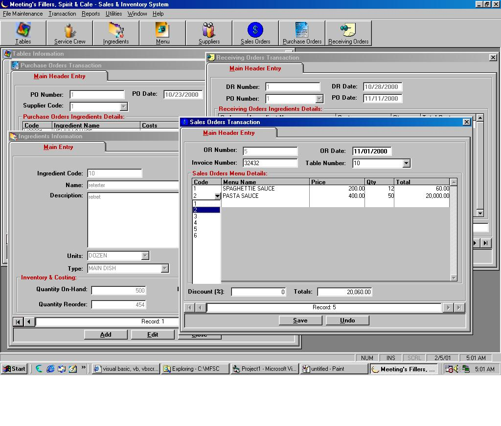



## SALES & INVENTORY PROGRAM using ADO & Crystal Report \(A must see\.\.\)

### Description

Don't miss this guys coz' this is a corporate code that i developed before using ADO with complete Login Entry,Masterfiles,Transactions such as Sales Order, Purchase Order,Receiving Order, Reports such as Inventory Report,Sales Report,Critical Report and Backup/Restore/Password Security features. Using this example you can learn a lot about how ADO really works without using any data controls. This is the best contribution of mine in PSC so far so you better not miss this coz' this code really rocks. PLEASE DON'T FORGET TO VOTE FOR THIS CODE COZ' THIS CODE REALLY ROCKS!!!
 
### More Info
 

             |
---                |---
**Submitted On**   |2001-02-05 05:02:14
**By**             |[Walter Narvasa](https://github.com/Planet-Source-Code/PSCIndex/blob/master/ByAuthor/walter-narvasa.md)
**Level**          |Advanced
**User Rating**    |3.2 (582 globes from 184 users)
**Compatibility**  |VB 6\.0
**Category**       |[Databases/ Data Access/ DAO/ ADO](https://github.com/Planet-Source-Code/PSCIndex/blob/master/ByCategory/databases-data-access-dao-ado__1-6.md)
**World**          |[Visual Basic](https://github.com/Planet-Source-Code/PSCIndex/blob/master/ByWorld/visual-basic.md)
**Archive File**   |[CODE\_UPLOAD14534242001\.zip](https://github.com/Planet-Source-Code/walter-narvasa-sales-inventory-program-using-ado-crystal-report-a-must-see__1-15016/archive/master.zip)

